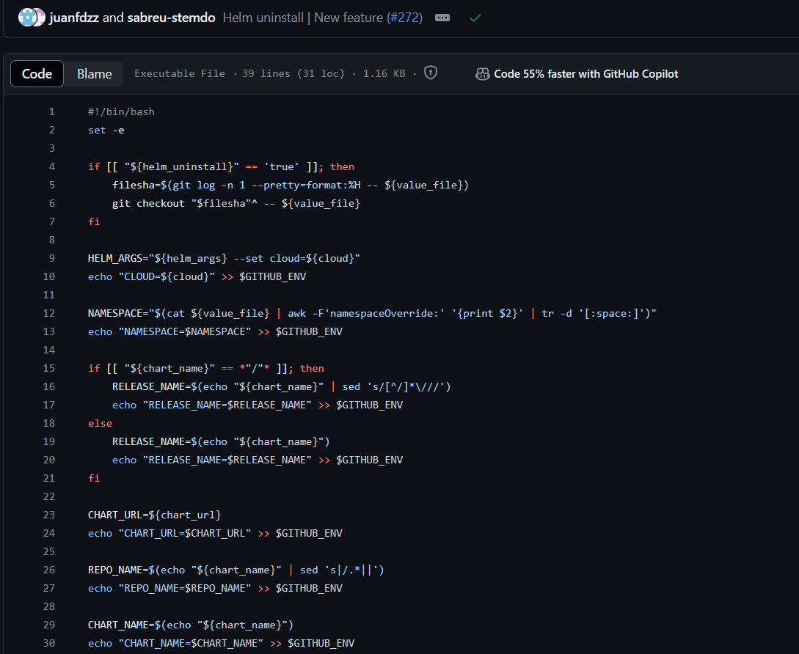

1. Redirecciones. Ver la importancia del control del stdin y stdout, tanto en ficheros como en variables.
2. Tuberias o Pipelines. Transferir el standard output de un comando hacia el standard input de otro.
3. Bucles y condicionales. Como en cualquier lenguaje de programación, imprescindibles.
4. Asignación de variables según scope. Global, local, de script, de entorno (github). En CI/CD se trabaja todo el rato con variables para automatizar el proceso a partir de una entrada, plantilla, etc.
5. Revisar con ellos el código en github hecho para Stemdo. ¿Qué porcentaje del repo está escrito en bash? ¿Qué importancia tiene bash sobre los runners que se utilizan en Github?
Nuestros runners tienen ubuntu de SO, que entiendan que son como una "instancia de shell" que dura sólo mientras se ejecute y luego se "resetea", hay que instalarle paquetes si no los tiene, etc. Como en su terminal de Linux.

- helm_diff.sh < Condicionales, bucles, stdin y stdout.

- set_env.sh < Importancia de variables

- helm-v2.yml < Runner de Ubuntu, instalación de herramientas, todo va a parar aquí para llevar a cabo la acción deseada, asignar variables a ejecucion de comando y control del flujo con condicionales.

